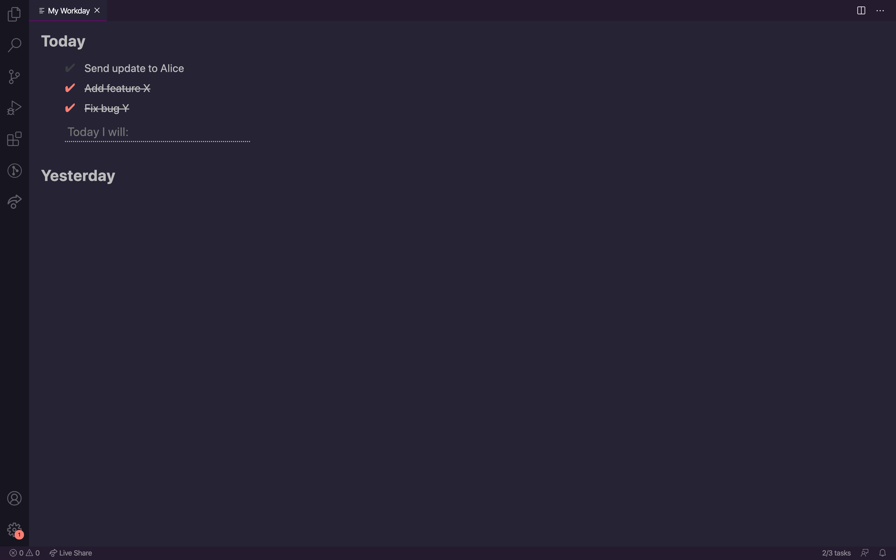

# Workday for Visual Studio Code

This extension provides user friendly todo lists seperated by vscode workspace allowing you to track tasks by project.

## Getting started

1. Install Workday from the marketplace
2. Start the extension by opening the command palette using keyboard shortcuts Cmd+Shift+P (Ctrl+Shift+P on windows) and searching `workday`
3. Add/Delete/Complete todos and then use shortcut Cmd+W (Ctrl+W for windows) to close Workday.
4. See the number of remaining todos in the status bar at the bottom of vscode

## Features

- [x] Add/Delete/Complete todos
- [x] Per workspace todo list
- [x] Incomplete todos are carried over
- [x] Quickly access and see the number remaining todos in status bar

### Future features

- [] Prioritise items
- [] Export list of completed todos
- [] Workday timer: pomodoro style

## [License](LICENSE)

[MIT](LICENSE)
